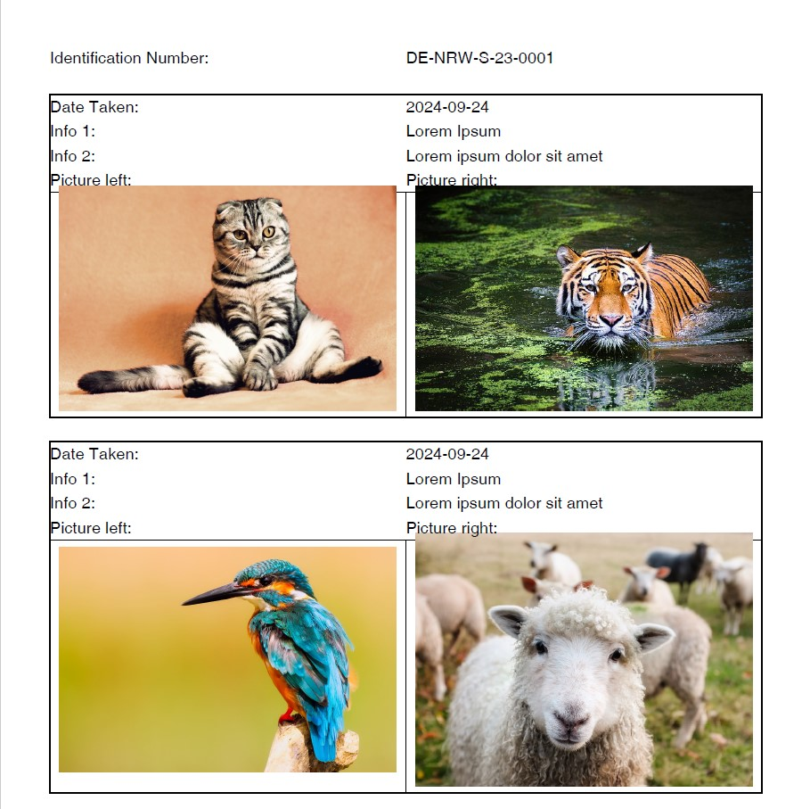

# OpenPDFSample
little sample app to generate a PDF document with [OpenPDF](https://github.com/LibrePDF/OpenPDF).

# How to run
Just execute OpenPDFSample to generate the PDF file.

# Images
All sample images taken from Pixabay 
All images are free to use under the Pixabay [Inhaltslizenz](https://pixabay.com/de/service/license-summary/) 
[Schafe](https://pixabay.com/de/photos/irland-die-schafe-l%C3%A4mmer-vieh-1985088/) 
[Eisvogel](https://pixabay.com/de/photos/eisvogel-vogel-nahaufnahme-sitzend-2046453/) 
[Tiger](https://pixabay.com/de/photos/tiger-sumpf-gro%C3%9Fe-katze-wildkatze-2535888/) 
[Katze](https://pixabay.com/de/photos/katze-k%C3%A4tzchen-haustiere-tiere-2934720/)

# Result
Screenshot of the first page of the generated PDF file: 
